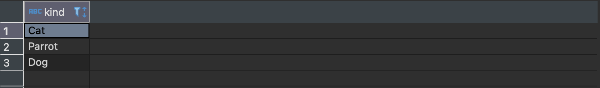

# Day 13, 11.09.2025
<span style="color:grey">
Daily Routine
</span>

--- 
## __Basic Overview__
 

* <span style="color:grey"> Daily Protocol</span>
* <span style="color:grey"> SQL Advanced Exercises </span>

## __Schedule__
<span style="color:grey">

|Time|Content|
|---|---|
|09:00 - 10:00|Daily Review|
|10:00 - 12:30|Group project on Python and SQL|
|12:30 - 13:30|Lunch Break| 
|13:30 - 17:00|Group project on Python and SQL|


</span>

## __Groups & Tasks__

<span style="color:grey">

1. **Group 1:** 
    - Finish Python Notebooks
     
2. **Group 2:** 
    - SQL Practice with Game → work in group or pairing 
    
        [SQL Games Source 01 (Collection of games)](https://github.com/neuefische/learning-games)
    
        [SQL Games Source 02 (murder mystery)](https://mystery.knightlab.com/) 
 
3. **Group 3:**  
   - Advanced SQL Challenge (half day) → pairing  
   - DBT Tutorial (half day) → pairing
    
    Here you can find Mona lisa (Project/Dataset)

    <div style="display: flex; justify-content: center;">
    <div style="text-align:center">
    
    <p>Project</p>
    </div>
    <div style="text-align:center">
    
    <p>Dataset</p>
    </div>
    </div>

</span>

##  __Objective__

<span style="color:grey">

- Review and reinforce previous concepts during the Review session  
- Progress in Python programming skills and complete Python Notebooks  
- Practice and enhance SQL skills through games and advanced challenges  
- Learn teamwork and collaboration in solving practical tasks  
- Gain familiarity with Advanced SQL and DBT to develop analytical and practical data skills

</span>

<h1 style="color:#2E86C1; text-align:center; border-bottom: 2px solid #2E86C1; padding-bottom:5px;padding-top:12px;">
Review of the answers for the Pets Project
</h1>

1. How many pets, how many owners? Hint: [Use COUNT()](https://www.postgresql.org/docs/8.2/functions-aggregate.html)

```sql
-- Practice 01-01
SELECT count(DISTINCT petid)
FROM pets;
```

Expected output pets:


```sql
-- Practice 01-02
SELECT count (DISTINCT ownerid)
FROM pets;
```
Expected output owners:


2. What are the most and least common pet names? Hint: [Use ORDER BY](https://www.postgresql.org/docs/8.1/queries-order.html)

```sql
-- Practice 02-01
SELECT name,count(*) AS count
FROM pets
GROUP BY name ORDER BY count DESC
LIMIT 1;
```
Expected Output most common name: 


```sql
-- Practice 02-02
SELECT name,count(*) AS count
FROM pets
GROUP BY name ORDER BY count ASC  
LIMIT 1;
```
Expected Output least common name: 


3. What kind of pets do we have? Hint: [Use DISTINCT](https://www.postgresql.org/docs/9.5/sql-select.html)
```sql
-- Practice 03
SELECT DISTINCT kind
FROM pets;
``` 
Expected output:



4. What is the gender balance across pets and species? Hint: [Use GROUP BY](https://www.postgresql.org/docs/9.4/tutorial-agg.html)

```sql
-- Practice 04-01
SELECT gender,count(*) AS count
FROM pets
GROUP BY gender
ORDER BY gender;
``` 
Expected output gender balance pets:


```sql
-- Practice 04-02
SELECT kind,gender,count(*) AS count
FROM pets
GROUP BY kind,gender
ORDER BY kind,gender DESC;
```
Expected output gender balance pets by kind:


5. What is the average age of the pets? Hint: [Use AVG()](https://www.postgresql.org/docs/9.4/tutorial-agg.html)

```sql
-- Practice 05
SELECT AVG(age) AS avg_age
FROM pets;
```

Expected output: 


6. How many owners have more than one pet? Hint: [Use GROUP BY HAVING](https://www.postgresql.org/docs/9.4/tutorial-agg.html)

```sql
-- Practice 06
SELECT  COUNT(*) AS count
FROM (
	SELECT ownerid
	FROM pets
	GROUP BY ownerid
	HAVING COUNT(*) > 1
	) 
AS subquery;
```

Expected output: 


7. Do the owners that have more than one pet have the same kind of pet. [Use ARRAY_AGG](https://www.postgresqltutorial.com/postgresql-aggregate-functions/postgresql-array_agg/)

```sql 
-- Practice 07
SELECT ARRAY_AGG(kind) AS pet_list ,ownerid  
FROM pets
GROUP BY ownerid HAVING COUNT(*) > 1;
```

Expected output (one possible approach): 


8. Do owners name their pets like owners? Hint: [Use INNER JOIN](https://www.postgresql.org/docs/8.3/tutorial-join.html)

```sql 
-- Practice 08
SELECT 
	o.name AS owner_name,
	p.name AS pet_name
FROM owners o 
INNER JOIN pets p
ON o.ownerid = p.ownerid 
WHERE o.name = p.name;
```

Expected output: 


9.  Extract the information of pet names and owners side-by-side! Hint: [Use FULL JOIN](https://www.postgresql.org/docs/8.3/tutorial-join.html)

```sql 
-- Practice 09
SELECT 
	o.name AS owner_name,
	p.name AS pet_name,
	p.ownerid  AS ownerid
FROM owners o 
FULL JOIN pets p 
	ON o.ownerid = p.ownerid
ORDER BY o.ownerid ASC;
```

Expected output (only first rows shown):


10.  What are the cities with the largest amount (top 3) of pets? Hint: 
[Use INNER JOIN](https://www.postgresql.org/docs/8.3/tutorial-join.html)

```sql 
-- Practice 10
SELECT 
	o.city,
	COUNT(p.ownerid) AS total_pets
FROM owners o
INNER JOIN pets p 
	ON o.ownerid = p.ownerid
GROUP BY o.city
ORDER BY total_pets DESC
LIMIT 3;
```

Expected output: 


## __Notes__

<span style="color:grey">

- Always check **table structure and data types** before writing queries.
- Using aliases (`AS`) improves code readability.  
- Build queries **step by step** to make debugging easier.
- Group division helped students focus more on each topic  
- Pairing and group work facilitated faster and better problem solving
</span>

