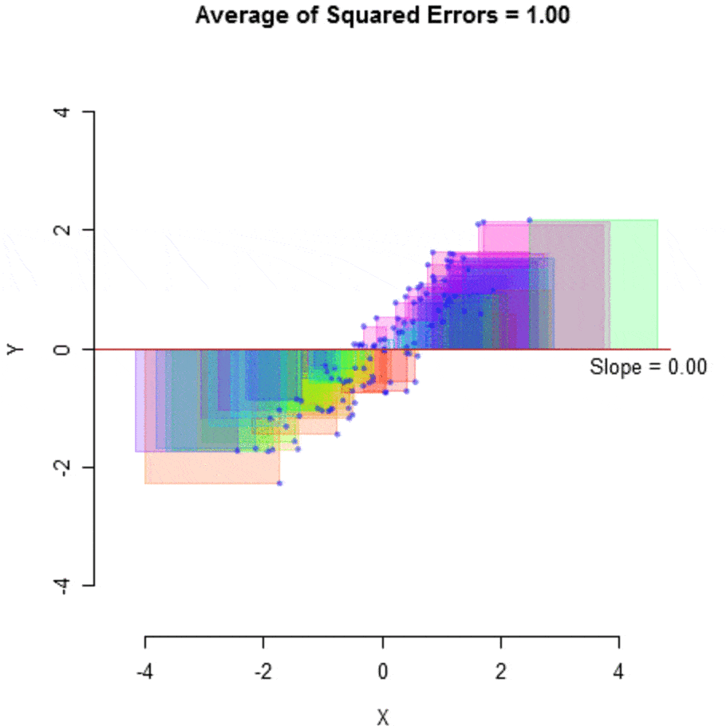

# Day 22, 22.09.2025

##  __Basic Overview__
 

*  [Linear Regression: theory](#linear-regression)
*  implementation in pandas
*  first model training

---
##  __Schedule__

|Time|Content|
|---|---|
|10:00 - 11:15|Lecture on Linear Regression|
|11:15 - 11:30|Reflection on lecture|
|11:30 - 13:00|Lunch Break| 
|13:00 - 18:30   (or whenever finished) |Self-study/Pair-Programming:  Practical exercises|

---
## __Linear Regression__ 
Goals  (Why do we need this?):

* explanation  (Why is my house worth xyz?) &rarr; descriptive statistics
* prediction  (How much is my house worth?) &rarr; inferential statistics

### Regression: 

* *regredi* (Latin) = to go back
* "going back" from a cloud of data points to find the underlying relationship

### Linear Regression:

* assuming two (or more) variables have a certain kind of relationship - **linear**
* using this assumption to find the equation that best describes this relationship

  <a href="https://ideal-adventure-6vymekm.pages.github.io/_images/6ebd10e7ee7ec8605f50720098e185e572eeb40bfceff8adeea66193e5ec2073.png" target="_blank">Source: Salt&Pepper Cookbook</a>

    
| General Equation     | Key Terms |
|----------------------|-----------|
| y = b₀ + b₁x + e     &rarr; find b₀ and b₁! | Intercept (b₀, value of y when x = 0)   Slope (b₁, weights/coefficients)   Residuals (e, difference in estimated vs. true value: eᵢ = yᵢ - ŷᵢ) |

  <a href="https://www.reneshbedre.com/blog/learn-to-calculate-residuals-regression.html" target="_blank">Source: RS Blog</a>

idea: finding the "line" (aka fit) that best describes the data

how: looking at the sum of the residuals ("errors")
less errors -> better fit
residuals are squared and summed, so that negatve and positive values don't negate each other

  <a href="https://medium.datadriveninvestor.com/asap-guide-to-linear-regression-fda841656fbd" target="_blank">Source: ASAP Guide to Linear Regression</a>

mean squared error erklären

Correlation — measures the strength of the relationship → a number

Regression — quantifies the nature of the relationship → an equation

It's not just prediction.

It's a form of retrospection: finding the best linear relationship that could have produced this data.

### Least squares criterion
Sum of squared residuals: $\sum_{i=1}^n e_i^2$

$ b_1 = \frac{\sum (y_i - \bar{y})(x_i - \bar{x})}{\sum (x_i - \bar{x})^2} $

### What counts as linear regression/equation?

✅ Linear regression (βs enter linearly):
y = β0 + β1·x
y = β0 + β1·x + β2·x²
y = β0 + β1·log(x)

❌ Not linear regression (βs enter nonlinearly):
y = β0 + x^β1        (β in exponent)
y = β0 + (β1)²·x     (β squared → nonlinear in β)

So: a quadratic curve in x can still be linear regression. 
In linear regression, "linear" means linear in the coefficients (β).
We treat all functions of x (like x, x², log(x), …) as fixed terms, and only the βs are the free parameters.

So a model like
y = β0 + β1·x + β2·x²
is still linear regression: the βs enter linearly, even though the slope
dy/dx = β1 + 2β2·x
is not constant.

## Assumptions
1. **Linearity**: The target variable and the coefficients of the explanatory variables are linearly related.
2. **Zero-Mean Error**: The mean of all residuals is zero.
3. **Strict Exogeneity**: All the explanatory variables are uncorrelated with the residual.
4. **Homoscedasticity**: The variance of the residuals across a single observation remains the same.
5. **No Multicollinearity**: All the explanatory variables are linearly independent.

## Multiple Linear Regression

blabla

---
## __Exercise: Implementation in sklearn & the other__ 

* you make a heading with \#, one for a level one heading, which is the largest - you can go down to level 6
* starting a new line: use a double space
* use single asterisks or underscores to make words italic (\*words* makes *words*) 
* use double asterisks or underscores to make words bold (\*\*this** makes **this**)
* use both at the same time with three asterisks or hyphens (\_\_\_ x ___ makes ___x___)
* you make a divider with three hyphens (---)
* you can make unordered lists with an asterisk (*) and ordered list with any number, a period and a space: \1.  
(__super useful__: it doesn't matter which number you choose, it will be displayed as 1,2, etc. )

---

## __Links, Quotes, Pictures and GIFs__

* you can use links in your notes by using this formatting:  
[link text](link URL “title”) becomes [neue fische website](https://www.neuefische.de/ "neue fische website")
* you can also use pictures in your notes by using this format:   
 becomes 
* block quotes: you can highlight a quote from someone by using an angle bracket (>), for example: 
    > I think there is a world market for maybe five computers. - Thomas J. Watson Sr.
* use GIFs with the same formatting as links and pictures, the URL you use must end with .gif and if it expires, your gif will not be seen anymore  
example: 

---
##  __Taking Good Notes__ 

* stick to one style, e.g. links are in italic, keywords are in bold, dividers inbetween topics, etc.  
* don't vary your text style too much, keep it simple
* use bold and italic words rarely so they stand out more

---

##  __Code inside notes__ 
You can insert blocks of code into your notes with Markdown by wrapping the code in backticks (\`)
\`/from x import y\` becomes  
`/from x import y`

---
##  __Helpful References__
* [pre-preppers](https://docs.google.com/presentation/d/1a7cdrUL_-Reg-myKLcfaBgx_ReR2efUf/edit?slide=id.p1#slide=id.p1)
* [Slides](https://ideal-adventure-6vymekm.pages.github.io/sessions/08_Linear_Regression.html#)
* [Markdown Cheatsheet on Github](https://github.com/adam-p/markdown-here/wiki/Markdown-Cheatsheet) 
* [Guide to Markdown for Documentation Writers](https://document360.com/blog/introductory-guide-to-markdown-for-documentation-writers/#p8)
* [Markdown Crash Course by Traversy Media](https://www.youtube.com/watch?v=HUBNt18RFbo)
* [Basic Markdown Introduction and Syntax by Mike Dane](https://www.youtube.com/watch?v=2JE66WFpaII)

  

    <strong>General equation:</strong> 
        <math xmlns="http://www.w3.org/1998/Math/MathML">
        <mi>y</mi>
        <mo>=</mo>
        <msub>
            <mi>b</mi>
            <mrow data-mjx-texclass="ORD">
            <mn>0</mn>
            </mrow>
        </msub>
        <mo>+</mo>
        <msub>
            <mi>b</mi>
            <mrow data-mjx-texclass="ORD">
            <mn>1</mn>
            </mrow>
        </msub>
        <mo>&#x22C5;</mo>
        <mi>x</mi>
        <mo>+</mo>
        <mi>e</mi>
        </math>  
        → Find <math xmlns="http://www.w3.org/1998/Math/MathML">
        <msub>
            <mi>b</mi>
            <mn>0</mn>
        </msub>
        </math>
        and <math xmlns="http://www.w3.org/1998/Math/MathML">
        <msub>
            <mi>b</mi>
            <mn>1</mn>
        </msub>
        </math>!
  

  

    <strong>Key terms:</strong> 
Intercept (<math xmlns="http://www.w3.org/1998/Math/MathML"><msub>
            <mi>b</mi>
            <mrow data-mjx-texclass="ORD">
            <mn>0</mn>
            </mrow>
        </msub> </math>, value of <math xmlns="http://www.w3.org/1998/Math/MathML">
        <mi>y</mi>
        <msub>
        </math> when <math xmlns="http://www.w3.org/1998/Math/MathML">
        <msub>
            <mi>x</mi>
        </msub>
        <mo>=</mo>
        <msub>
            <mi>0</mi>
        </msub>
        </math>) 
Slope (b1, weights) 
Residuals (<math xmlns="http://www.w3.org/1998/Math/MathML">
        <msub>
            <mi>e</mi>
        </msub> </math>
        <math xmlns="http://www.w3.org/1998/Math/MathML">
        <msub>
            <mi>e</mi>
            <mi>i</mi>
        </msub>
        <mo>=</mo>
        <msub>
            <mi>y</mi>
            <mi>i</mi>
        </msub>
        <mo>&#x2212;</mo>
        <msub>
            <mrow data-mjx-texclass="ORD">
            <mover>
                <mi>y</mi>
                <mo stretchy="false">^</mo>
            </mover>
            </mrow>
            <mi>i</mi>
        </msub>
        </math>)
  

 