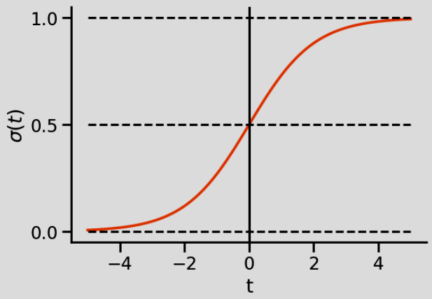
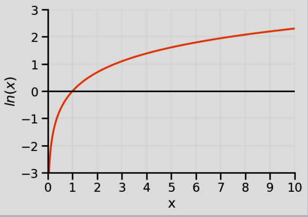
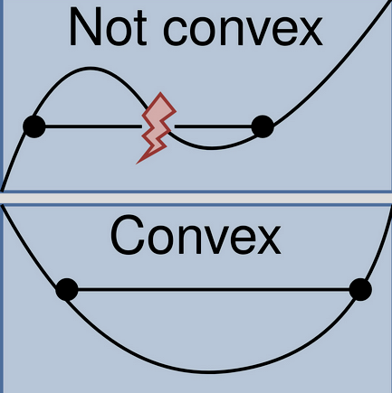

# Day 27 — 30.09.2025
## Basic Overview
* [Logistic Regression](#logistic-regression)
* [What?](#what)
* [Sigmoid Function](#1-sigmoid-function)
* [Logit Function](#2-logit-function)
* [Cost Function](#cost-function-log-loss)
* [Decision Boundary](#decision-boundary)
* [Code](#code)
* [Resources](#resources)

## Schedule
Time| Content
-- | --
09:00 - 10:00 | Daily review
10:00 - 12:00 | Presentation
12:00 - 13:00 | Lunch
13:00 - End of Day | Work on notebooks


# Logistic Regression

### What?
A classification algorithm that predicts the probability of a binary outcome. Used in **supervised Learning**, where model uses annotated data (eg foto with label) to learn classification

**difference to Linear Regression:**
- Linear regression predicts continuous values and can output any number
- Logistic regression predicts probabilities (bounded between 0 and 1) and classifies into discrete categories

**Use cases:**
- email spam detection, sentiment analysis (sad/not sad), medical diagnosis, survive-die, admitted-rejected...
- can be extended to **multi-class classification**
- useful for categorical variables?

**🚧 Limitations**
- avoid for non-linear / complex boundaries
- sensitive to outliers / multicollinearity
- feature scaling matters (standardize to same scales)
- not good on small datasets
---


### 1. Sigmoid Function
- Takes any real number ($z$) as input
- Outputs a probability between 0 and 1
- Creates an S-shaped curve
- -> Maps number to probability (0 to 1)
- Used for predictions
- $σ(z) = 1/(1 +  e⁻ᶻ)$
- $z = θ₀ + θ₁x₁ + θ₂x₂ + ...$ <- make it linear optimization problem

<!--  -->
<!--  -->


- default threshold is 0.5
    - if h_b(x) >= 0.5 ➡ sad
    - if hypothesis h_b(x) < 0.5 ➡ not sad

### 2. Logit Function
- aka [LogOdds](https://www.youtube.com/watch?v=ARfXDSkQf1Y&list=PLblh5JKOoLUKxzEP5HA2d-Li7IJkHfXSe&index=2&pp=iAQB)
- -> Maps probability (0 to 1) to number
- Used for training/optimization
- $logit(p) = log(p/(1-p)) = θ₀ + θ₁x₁ + θ₂x₂ + ...$

> sigmoid + logit functions are needed, because transformation goes in **both directions**


### Cost Function: Log Loss
- aka **Binary Cross-Entropy** / **LLF**

- **Goal:** Minimize J(θ) to increase confidence and reduce misclassification
$$ J(θ) = -1/m Σ [y_i log(h_θ(x_i)) + (1 - y_i) log(1 - h_θ(x_i))] $$

- probability close to 0 -> high Loss
- probability close to 1 -> low Loss
- **Loss** = error for a single data point
- **Cost** = average loss across **all** data points

- ⚠️ cost function must be **convex** to guarantee finding the global minimum using **gradient descent**


**Why not use MSE (Mean Squared Error)?**
- Linear regression uses: $J(θ) = Σ(y_i - ŷ_i)²$
- but this creates a **non-convex** function for logistic regression
- which is hard to optimize


---
## Decision Boundary
- aka **threshold**
- where the model switches predictions
- corresponds to TPR & FPR (true/false positive rate > see metrics)
- if probability bigger or equal than threshold, classify as 1, else 0

**Decision boundary formula:**
- A point lies on the decision boundary when probability = 0.5
- Since $\sigma (0) = 0.5$, this means:
    - b₀ + b₁x₁ + b₂x₂ = 0
- With **1 feature (x₁ only):** $ x_1 = -b_0/b_1$
- With **2 features:** $x₂ = -(b₀ + b₁x₁)/b₂$ → a straight line in 2D
> with 3+ features boundary becomes hyperplane in n-dimensional space 🤪

---

## 🔑 Key Takeaways

✅ Logistic regression predicts **probabilities**, not raw values
✅ The **sigmoid function** squashes outputs to [0, 1] range
✅ **Log loss** creates a convex cost function (unlike MSE)
✅ **Gradient descent** iteratively finds optimal parameters
✅ The **decision boundary** splits the feature space into classes
✅ **Logit & sigmoid** are inverse functions that transform between probability and log-odds spaces
✅ Coefficients can be interpreted as the effect of features on log-odds of the outcome

---


## code
### snippet 1 - basic workflow
- prepare data / EDA
- select predictors X & target y
- split into train/test sets -> X_train, X_test, y_train, y_test

```py
from sklearn.linear_model import LogisticRegression
import pandas as pd
import seaborn as sns

# 1. Train model
model = LogisticRegression(max_iter=1000)
model.fit(X_train, y_train)

# 2. Predict with default threshold = 0.5
y_pred = model.predict(X_test)

# 3. Confusion matrix (frequency table)
conf_matrix = pd.crosstab(y_test, y_pred, rownames=['Actual'], colnames=['Predicted'])

# 4. Plot heatmap
sns.heatmap(conf_matrix, annot=True, cmap="Blues", fmt="d")
```
---
### snippet 2 - custom threshold
- predict_proba()
- show classification_report for metrics
```py
import numpy as np
from sklearn.metrics import classification_report

# ... insert code here ...

# LogisticRegression.predict() uses threshold = 0.5 internally
probs = model.predict_proba(X_test)[:, 1]   # probability of class 1

# Custom threshold
threshold = 0.3
predictions = (probs >= threshold).astype(int)

# Classification report
print("\nClassification Report:\n", classification_report(y_test, predictions))
```
---
### snippet 3 - sigmoid & logit function
- from slides to play around with these functions
```py
import pandas as pd
from matplotlib import pyplot as plt
import numpy as np

# create the sigmoid function
def sigmoid_function(t):
    '''Calculates p for given t'''
    p = 1/(1+np.exp(-t))
    return p

# create the logit function
def logit_function(x, b0, b1):
    '''Caluculates the border'''
    t = b0 + b1*x
    return t

b0 = 0
b1 = 0.2

x = np.arange(-50, 50, 1)
t = logit_function(x, b0, b1)
p = sigmoid_function(t)

plt.plot(x,p, color=black)
plt.vlines(x=-b0/b1,ymin=0, ymax=1,color=blue,linestyle='--', linewidth=1.2)
plt.hlines(y=0.5,xmin=-50, xmax=-b0/b1,color=, linestyle='--', linewidth=1.2)
plt.show()
```
---
## Resources

- [slides](https://ideal-adventure-6vymekm.pages.github.io/sessions/12_Logistic_Regression.html)
- [git repo](https://github.com/neuefische/ds-logistic-regression)
- [StatQuest: Logistic Regression](https://www.youtube.com/watch?v=yIYKR4sgzI8)
- [StatQuest: LogOdds / logit()](https://www.youtube.com/watch?v=ARfXDSkQf1Y&list=PLblh5JKOoLUKxzEP5HA2d-Li7IJkHfXSe&index=2&pp=iAQB)
- 📚 [Hands-On Machine Learning with Scikit-Learn](https://www.amazon.com/Hands-Machine-Learning-Scikit-Learn-TensorFlow/dp/1492032646)
- [Andrew Ng's Machine Learning Course](https://www.coursera.org/learn/machine-learning)
- [SVM Decision Boundaries Visualization](https://www.researchgate.net/figure/Classification-results-of-SVC-with-the-nonlinear-decision-boundary_fig1_255572951)

