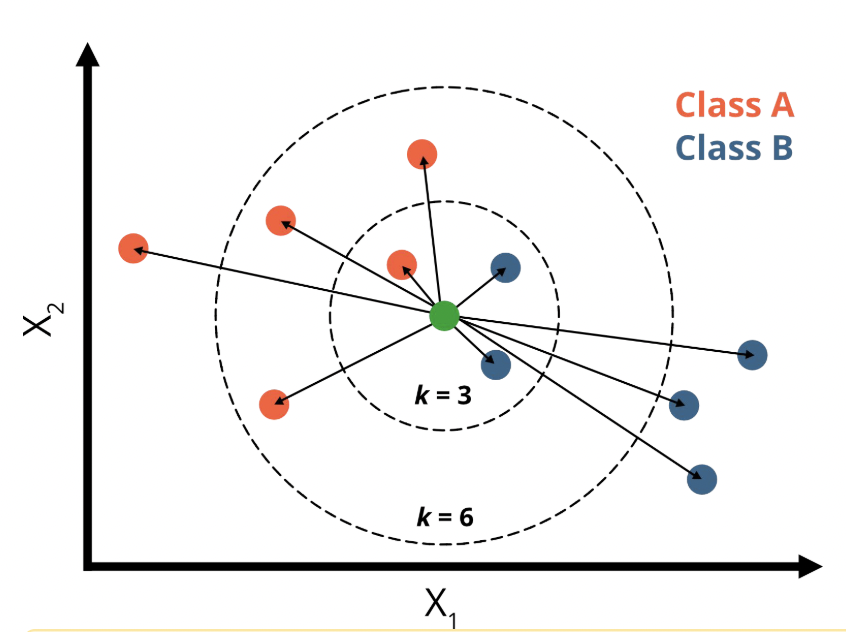
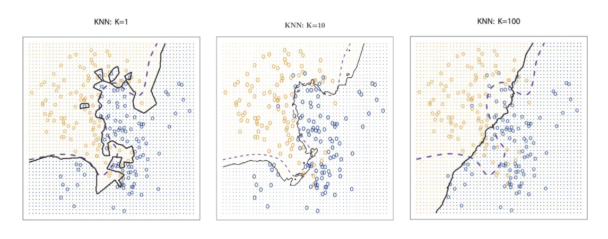
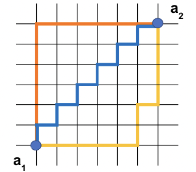
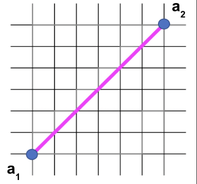

# Day 29, 02.10.2025
# KNN & Distance Metrics
---
##  __Basic Overview__
 
1.  The KNN Algorithm
2.  Hyperparameters in KNN
3.  Distance Metrics

---
##  __Schedule__

|Time|Content|
|---|---|
|09:30 - 10:00|Daily Review|
|10:00 - 11:00|Lecture - KNN and Distance Metrics|
|11:00 - 12:30|Lunch Break| 
|12:30 - 17:00|Practical exercises|

---
##  1. The KNN Algorithm

### 1.1 What is it?

- A supervised machine learning algorithm
- Used to solve both regression and classification problems

### 1.2 Key Ideas/Assumptions

- Assumes that similar things exist in close proximity 
- Similar observations belong to the same class


### 1.3 Difference from linear and logistic regression

KNN is a Non-parametric algorithm, which means it makes no assumption about the shape or distribution of data.

While linear and logistic regression fit coefficients (parameters) for each feature, KNN does not use a fixed set of parameters. It keeps the full training data (and therefore has very short training time) and make predictions for new data points based on all data.

### 1.4 How it works

1. Store input data with features that are comparable and a target variable

2. For each new point:
    - Loop over the observations
    - Calculate the distance to all data points
    - Sort them and pick the K closest neighbours

3. Output:
    - For classification: the most common class (the mode) of the neighbors
    - For regression: the mean of neighbors’ values

#### Classification example: Customer segmentation
- Dataset: Age, spending score, income, shopping frequency
- Task: Classify customers into “budget,” “regular,” or “premium”
- KNN finds similar customers and assigns the group based on the majority

#### Regression example: Weather Forecast
- Dataset: temperature, humidity, wind
- Task: Predict tomorrow’s temperature
- KNN finds past days with similar conditions and averages their next-day temperatures
 
### 1.5 Application of KNN.fit()

Training phase (fast):
- 'Remembering' / storing all data points 

Prediction phase (slow): 
- Calculates distance between new observations and every training data point
- K closest points are determined
- New data are assigned to the class of their nearest neighbors according to majority of voting

Visual example:



If K=3, and 2 neighbors are Blue, 1 is Orange → predict Blue.

If K=6, and 4 neighbors are Orange, 2 are Blue → predict Orange.

Python code (for classification)

```python
# Importing the libraries
import numpy as np
import pandas as pd
import seaborn as sns

from sklearn.metrics import confusion_matrix, accuracy_score, recall_score
from sklearn.neighbors import KNeighborsClassifier
from sklearn.model_selection import train_test_split

# Define X and y
X = df['feature', 'columns']
y = df['target']

# Split data into train and test set
X_train, X_test, y_train, y_test = train_test_split(X, y, random_state=1)

# Train model
knn = KNeighborsClassifier(n_neighbors=5, metric='euclidean') # Select K and distance metric
knn.fit(X_train, np.ravel(y_train))

# Predict on test set
y_pred = knn.predict(X_test)

# Model evaluation
print("Accuracy:", accuracy_score(y_test, y_pred).round(2))
print("Recall:", recall_score(y_test, y_pred).round(2))
print("-----"*10)

# Print confusion matrix
sns.heatmap(confusion_matrix(y_test, y_pred), annot=True, cmap='YlGn');

```

### 1.6 Check for outliers

We use the z-score to identify outliers, that standardizes each data point, expressing how many standard deviations it is from the mean. Data points with a z-score beyond a set threshold (commonly ±3) are considered potential outliers because they fall into the extreme parts of the distribution, far from the average. 

```python
# Find outliers according to zscore > 3 criterion
features=df.columns.drop('target_variable')
zscores=zscore(df[features])
is_outlier=(zscores>3)

print('These are the outliers:')
outliers=df[features][is_outlier]
display(outliers)

print('These are their zscores:')
display(zscores[is_outlier])

# Plots marking the outlier

fig,ax = plt.subplots(2,3,figsize=(16,9))
ft_combinations=combinations(features,2)
for i,(f1,f2) in enumerate(ft_combinations):
    sns.scatterplot(data=df,x=f1,y=f2,hue='species',ax=ax[i%2,i%3])
    sns.scatterplot(data=outliers,x=f1,y=f2,color='red',s=500,marker='x',ax=ax[i%2,i%3])
```

### 1.7 Scaling

Because KNN finds the "nearest" neighbors by calculating distances between data points, we need to scale features with larger ranges or these will dominate the distance calculation which might produce poor results.

#### Scaling using standardisation

```python
std=StandardScaler()

X_train_std=std.fit_transform(X_train)
X_test_std=std.transform(X_test)

clf=KNeighborsClassifier(n_neighbors=5,metric='euclidean') # Create model and select hyperparameters
clf.fit(X_train_std,y_train)

y_pred=clf.predict(X_test_std)
print('Classification report:')
print(classification_report(y_test,y_pred))

print('\n\nConfusion matrix')
print(confusion_matrix(y_test,y_pred))
```

#### Scaling using normalisation

```python
norm=MinMaxScaler()

X_train_norm=norm.fit_transform(X_train) # Normalise
X_test_norm=norm.transform(X_test)

clf=KNeighborsClassifier(n_neighbors=5,metric='euclidean') # Create model and select hyperparameters
clf.fit(X_train_norm,y_train)

y_pred=clf.predict(X_test_norm)
print('Classification report:')
print(classification_report(y_test,y_pred))

print('\n\nConfusion matrix')
print(confusion_matrix(y_test,y_pred))
```

### 1.8 Pros vs. Cons

#### Positives with KNN

- No assumptions about data
- Simple algorithm that is easy to understand
- Can be used for both classification and regression

#### Limitations with KNN

-  High memory requirement (all of the training data must be present in memory in order to calculate the closest K neighbors)
- Sensitive to irrelivant features
- Sensitive to the scale of data since we are computing the distance to the closest K points

---
## 2. Hyperparameters in KNN


### 2.1 Number of neighbors (K)

K is normally an odd number, because if K is even, there is a chance of a tie between classes (binary classification).

Influence of K:
- Small K: Overfitting
- Large K: Underfitting



We need to tune K using cross validation to select the K with lowest error or highest accuracy

### 2.2 Distance metrics

Decides how closeness is measured

### 2.3 Weights for neighbors
Give all neighbors equal weight or decide to give closer ones more importance

---
## 3. Distance Metrics


How to measure 'close proximity'?
- KNN is based on the idea of similarity
- Mathematically similarity can be calculated via distances

#### 3.1 Manhattan Distance

The sum of absolute differences between the points' coordinates



Formula:

$\ Manhattan\: Distance = \sum_{i=1}^n |a_1,_i - a_2,_i|$

$\ Manhattan\: Distance = \sum_{i=1}^n side\: length$


Python Example:

```python
point_1 = (2, 3, 5)
point_2 = (1, -1, 3)

manhattan_distance = 0
for i in range(3):
    manhattan_distance += np.abs(point_1[i] - point_2[i])

manhattan_distance
```

#### 3.2 Euclidean Distance

The diagonal distance between two data points calculated using Pythagorean Theorem



Formula:

$\ Euclidean\: Distance = \sqrt{\sum_{i=1}^n |a_1,_i - a_2,_i|^2}$ <br>
$\ Euclidean\: Distance = \sqrt{\sum_{i=1}^n side\:length^2}$

Python Example:

```python
point_1 = (2, 3, 5)
point_2 = (1, -1, 3)

euclidean_distance = 0
for i in range(3):
    euclidean_distance += (point_1[i] - point_2[i])**2

euclidean = np.sqrt(euclidean_distance)

euclidean
```

#### 3.3 Minkowski Distance

A generalization of the Euclidean distance and can be used to calculate the distance between two points in an n-dimensional space

Formula:


$\ Minkowski\: Distance = \sqrt[p]{\sum_{i=1}^n |a_1,_i - a_2,_i|^p}$ <br>
$\ Minkowski\: Distance = \sqrt[p]{\sum_{i=1}^n side\:length^p}$

Python Example:

```python

point_1 = (2, 3, 5)
point_2 = (1, -1, 3)
p = 3 # Example with 3 dimensions

minkowski_distance = 0
for i in range(3):
    minkowski_distance += np.abs(point_1[i] - point_2[i])**p

minkowski = minkowski_distance**(1/p)

minkowski
```

#### 3.4 Chebychew Distance

Square to infinity - Instead of summing differences (like Euclidean or Manhattan), it takes the largest absolute difference across any feature/dimension.

Formula:

$Chebyshev\:Distance = \max_{i=1,...,n} |a_{1,i} - a_{2,i}|$


#### 3.5 Cosine Distance

Cosine similarity measures how similar two vectors are based on the angle between them. Cosine Distance is a way of converting similarity into a distance metric.

Formula:

$Cosine\:Similarity = \frac{\vec{A}\cdot\vec{B}}{\|\vec{A}\| \,\|\vec{B}\|}$


$Cosine\:Distance = 1 - \frac{\vec{A}\cdot\vec{B}}{\|\vec{A}\| \,\|\vec{B}\|}$


### 3.6 When to use which metric?

As the proximity of two points is defined by the distance between them, the choice of metric is of essential importance.

- Eludician Distance is the most commonly used distance metric, but should only be used in lower dimensional space (curse of dimensionality) when data is dense or continuous 
- For high dimensional, sparse data, Manhattan distance or cosine similarity are more applicable.


---

##  4. Helpful References
* [Pre-peppers](https://docs.google.com/presentation/d/1Z5QUtAJ95j9hR2YIERahZ1G9fEGFicYB/edit?slide=id.p1#slide=id.p1) 
* [Slides](https://ideal-adventure-6vymekm.pages.github.io/sessions/13_KNN_Distance_Metrics.html#knn-distance-metrics)
* [GitHub repository](https://github.com/neuefische/ds-distance-metrics-knn)
* [KNN Overview](https://www.geeksforgeeks.org/machine-learning/k-nearest-neighbours/)
* [Distance Metrics](https://www.geeksforgeeks.org/machine-learning/how-to-choose-the-right-distance-metric-in-knn/)
* [Cross Validation and Grid Search](https://towardsdatascience.com/cross-validation-and-grid-search-efa64b127c1b/)
* [KNN YouTube Tutorial](https://www.youtube.com/watch?v=CQveSaMyEwM)
