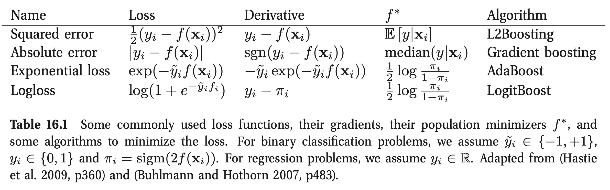
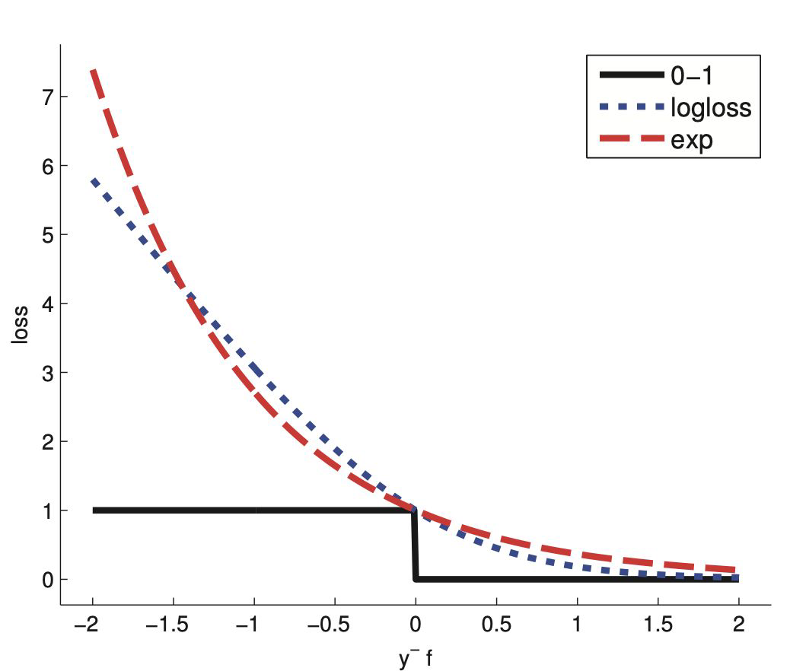

# Day 36 — 13.10.2025
## Basic Overview
* [Boosting](#Boosting)
* [Stacking](#Stacking)
* [References](#References)
## Schedule
Time| Content
-- | -- 
09:30 - 10:00 |Daily review
10:00 - 11:30 |Lecture
11:30 - 13:00 |Lunch Break
13:00 - 16:00 |Practical exercises
16:00 - end of the day| Work flow of machine learning

# Boosting
## What is boosting?
Learn *n* weak learners **sequentially** for **fitting adaptive basis function**.

$ f(x) = b_0 + \sum b_m \phi_m(x) $

- **$ \phi_m $** are generated by a weak learner
- the weak learner is applied **sequentially** to **weighted versions** of the data
- more **weight** is given to examples **misclassified** by earlier rounds
- the weak learner can be **any regressor or classifier** but it is common to use CART → decision tree

## Examples for boosting algorithms
- AdaBoost
- LogitBoost
- Gradient Boost
- Stochastic Gradient Boost
- XGBoost (eXtreme Gradient Boost)

### Boosting optimization
$ min \sum L(y_i, f(x_i)) $

### 1. AdaBoost
- loss function is exponential
- it’s putting lots of weight on misclassified examples
- after many iterations it can “carve out” a complex decision boundary
- slow to overfit
- sensitive to outliers
- probability estimates from f(x) cannot be recovered

### 2. Logitboost
- loss function is logloss
- punishes mistakes linearly
- one can extract probabilities from f(x)
 

### 3. Gradient boosting
- sequentially adding predictors
- based on the errors of the preceding model
- instead of minimizing the loss function at each stage to get the parameter update for $f$, we get $g_m$ the gradient for the loss of $f_{m-1}$

### 4. Stochastic Gradient Boosting
- use a random subset of instances
- higher bias but lower variance
- speeds up training

### 5. XGboost - Extreme Gradient Boosting
- optimized implementation
- scalable
- automatic implementation of early stopping and many more

# Stacking

* train weak learners in parallel
* combine by choosing the best for each observation
* this will obviously overfit
* using cross-validation to avoid overfitting

#  References
* Lecture slides
    * https://ideal-adventure-6vymekm.pages.github.io/sessions/16_Ensemble_Methods_part2.html

* Practical Machine Learning (2021 Fall), Stanford University
    * https://c.d2l.ai/stanford-cs329p/_static/pdfs/cs329p_slides_7_3.pdf

* ML Workflow Overview:
    * https://miro.com/app/board/uXjVJ7drVmI=/
