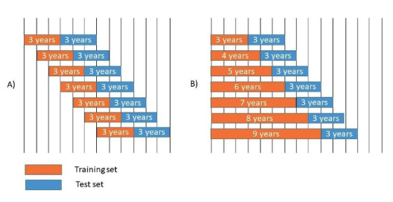
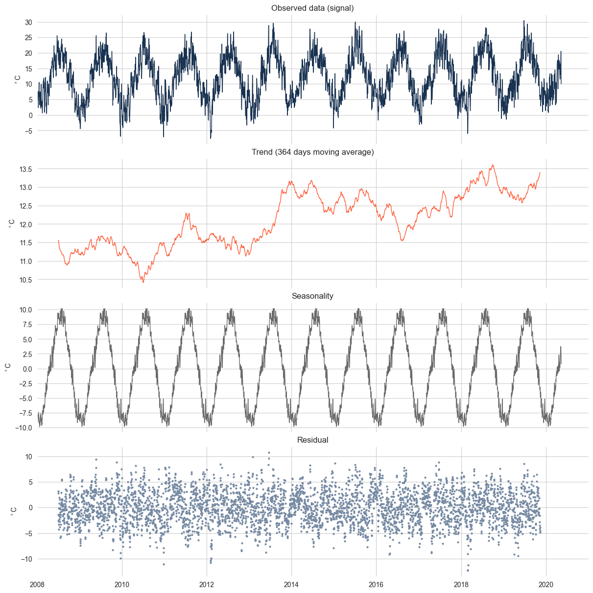
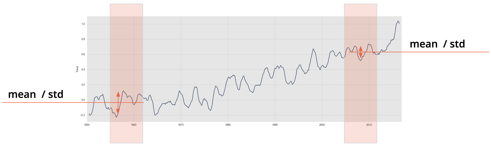
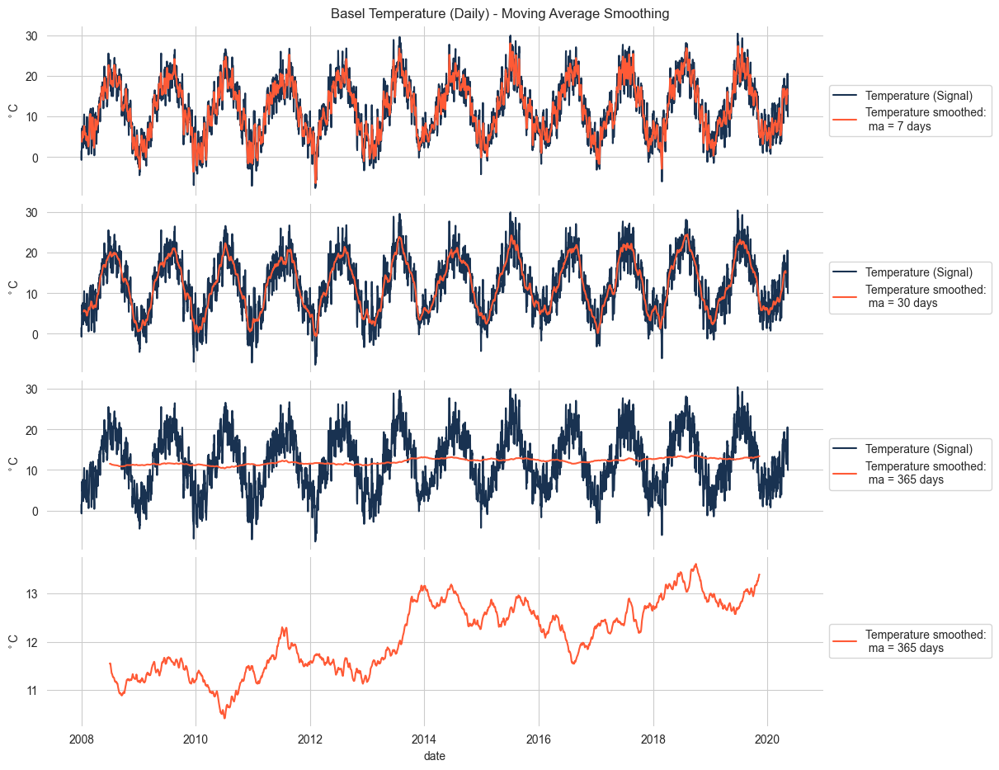
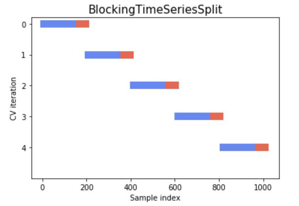
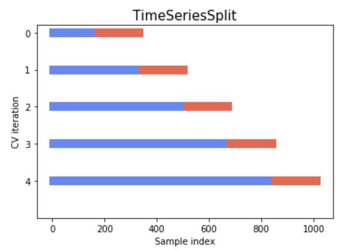

# Day 44, 04.11.2025 - Time Series

---
##  __Basic Overview__
 
Time series data is everywher. For example: temperatures recorded every day, stock prices, or daily sales.
What makes it different from normal data is that **order matters** Each point depends on what came before.
So, we can’t shuffle it like in other datasets. We always train on the past and predict the future


---
##  __Schedule__

|Time|Content|
|---|---|
|09:30 - 10:00|Daily Review|
|10:00 - 11:10|Introduction to Time Series|
|11:10 - 13:00|Lunch Break| 
|13:00 - 17:00|Group Work on Practical Exercises| 


## 1. What is Time Series
- **A series of data points collected over time**  

    eg: average monthly temperatures 1980-2021  
    eg: average sales of sneakers in January 2021  


- **Main Characters:**  
**- Dependency**:  Past values influence future ones  
    eg: 85% of today's temperature can be explained by yesterdays.   

    **- Order**:  We always move forward in time.    
    We train on the past and predict the future in order.  


     

## 2. Components

**Time Series** :  
**Signal (Observed) = Trend + Seasonality + Residual**

|Component     |Meaning     | What it shows|
|--------------|------------|--------------|
|Signal|Original observed data|Everything mixed together.|
|Trend|Long-term direction|Upward/downward movement (like a slow warming over year)|
|Seasonality|Regular cycles|Repeating patterns (like hotter summers)|
|Residual|Random noise|Unpredictable part -> random noise|  


  

### Decomposition Function: `seasonal_decompose()`

```python
#1. Compute
seas_decomp_yearly = seasonal_decompose(
    x=daily_data_df['temperature'], 
    model='additive', 
    two_sided=True,
    period= 365)

#2. Plot
fig= seas_decomp_yearly.plot()
```


## 3. Stationarity
- Make data predictable   
-> a constant mean + variance across the time series  

- Check its **stationarity**  
-> A time series needs to be stable to make a good prediction.  
-> Two methods to check the sationarity: 
(1)**ADF test** and (2) **KPSS test**  


   

### ADF Test
**ADF Test** - Augmented Dickey-Fuller test  
Ask: Is this series non-stationary?  
If we reject it -> the series is stationary.
   

H0 - Null hypothesis: the series **is not stationary**  
<span style=color:gray> H1  - Alternative hypothesis: the series is stationary</span>  
| p-value | Decision | Meaning |
|----------|-----------|---------|
| ≤ 0.05 | Reject H0 | The series is stationary |
| > 0.05 | Fail to reject H0 | The series is not stationary |


### KPSS Test
**KPSS test** - Kwiatkowski-Phillips-Schmidt-Shin test  
    -> Ask: Is this series stationary?  
    If we reject it -> the series is non-stationary.    

H0  - Null hypothesis: the series **is stationary**  
<span style=color:gray> H1 - Alternative hypothesis: the series is non-stationary</span>   

| p-value | Decision | Meaning |
|----------|-----------|---------|
| ≤ 0.05 | Reject H0 | The series **is not stationary** |
| > 0.05 | Fail to reject H0 | The series **is stationary** |  

### Autocorrelation Function: ACF & PACF
**ACF**: Autocorrelation Function  
 How much is ***today*** explained by ***past days*** overall?

**PACF**: Partial Autocorrelation Function  
How many days into the past still have a real effect on today's value?

**Example**: Sleep and energy   
**ACF** :  "How much does today's energy relate to past days overall?"  
**PACF** :  "If we remove what yesterday explains,
does anything from 2 or 3 days ago still influence today?"  

### Rolling Mean - A smoothing technique

- also call moving average
- taking the average of nearby values to smooth out short-term noise  

**Example: Basel Temperature**  
- The 7-day mean smooths week-to-week noise.  
- The 30-day mean smooths monthly fluctuations.  
- The 365-day mean flattens seasonality and shows long-term warming or cooling trends.

 


<video width="600" controls>
  <source src="../images/TSA_rolling_mean_unif.mp4" type="video/mp4">
</video>  


<video width="600" controls>
  <source src="../images/TSA_rolling_mean_exp.mp4" type="video/mp4">
</video>   


### Rolling mean vs ADF and KPSS tests  

-> **Rolling mean** helps you see if the data's average changes over time -> Here is one clue for whether it's stationary or not.   

-> The **ADF** and **KPSS** tests are **statistical ways** to check for stationarity.   

-> But before testing, we often visualize the series using a rolling mean to get a quick idea.

So:  
<span style=color:yellow>Rolling Mean</span> -> quick visual check   
<span style=color:yellow>ADF</span> -> formal statistical proof, test if the series is non-stationary   
<span style=color:yellow>KPSS</span> -> formal statistical proof, test if the series is stationary


## 5. Train-Test Split  
- Unlike other data, we can't shuffle time.  
- To test a model, we train on the past to predict the future in order.  
- Two ways to split the data:  
1. **Rolling Window**: fixed-size history slides forward -> only recent data counts.  
  


2. **Expanding Split**: training grows with time -> all histroy counts
  


## __Helpful References__

* [Time Series Repo](https://github.com/neuefische/ds-time-series.git)
* [Cross Validation in Time Series](https://medium.com/@soumyachess1496/cross-validation-in-time-series-566ae4981ce4)
* [Backtest ML Models for Time Series Forecasting](https://machinelearningmastery.com/backtest-machine-learning-models-time-series-forecasting/)


