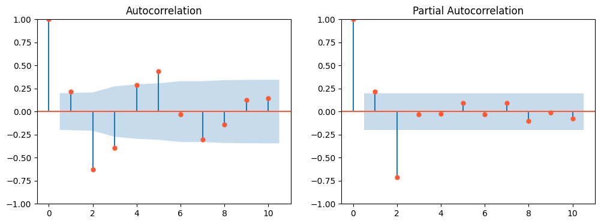

# Day 45, 05.11.2025 - Time Series - Continuation

##  __Basic Overview__
 
* Continuation of Time Series
* Brief introduction to other ARMA-like models

---
##  __Schedule__

|Time|Content|
|---|---|
|09:30 - 10:00|Daily Review|
|10:00 - 11:15|Continuation of Time Series|
|11:15 - ...|Continuation of (optional) Notebooks|

---
---

## 1. ARMA and similar models

### Related Models
- **ARMA:** Describes stationary time series with components:
    - autoregressive (AR) - means value dependent on predecessors values
    - moving average (MA) - means value is influenced by past errors / shocks / surprises
- **ARIMA:** Extends ARMA by integration for non-stationary means.  
- **SARIMA:** Extends ARIMA by seasonal components.  
- **ARMAX:** Extends ARMA by exogenous variables.  
- **SARIMAX:** Extends SARIMA by exogenous variables
- **ARFIMA:** Introduces long memory features.  
- **VAR:** Multivariate (vector) autoregressive model.  
- **Time-Varying Coefficients:** Capture dynamic relationships.
- **there are more...**
- (you could also decompose your data, use ARMA to forecast and afterwards add removed components back in)

### Forecasting
1. Estimate best fit model and retrieve parameters.  
2. Use parameters to forecast by:
   - Calculating innovations recursively.
   - Computing forecasts using observations and innovations.
3. Implementation available in `statsmodels`.

### Example of SARIMA implementation

~~~python
import pandas as pd
from statsmodels.tsa.statespace.sarimax import SARIMAX

# Assume your time series data is a pandas Series named `data`
# Example order: (p=1, d=1, q=1), seasonal_order: (P=1, D=1, Q=1, s=12)

# Here SARIMAX does not include "exog" parameter which makes it SARIMA (ie w/o X)
model = SARIMAX(data, order=(1, 1, 1), seasonal_order=(1, 1, 1, 12))
results = model.fit()

# Forecast the next 'n' periods
forecast = results.forecast(steps=12)

print(forecast)
~~~

---
### SARIMA Parameters
#### **order=(p, d, q)** - Non-Seasonal Components

| Parameter | Name | What it controls | How to determine |
|-----------|------|------------------|------------------|
| **p** | AR order | Number of lagged observations (autoregressive terms) | From **PACF**: Count significant lags before cutoff |
| **d** | Differencing order | Number of times to difference the series | By testing stationarity (ADF test). Usually 0, 1, or 2 |
| **q** | MA order | Number of lagged forecast errors (moving average terms) | From **ACF**: Count significant lags before cutoff |

**Example:** `order=(1, 1, 1)` means AR(1), first-order differencing, MA(1)

---

#### **seasonal_order=(P, D, Q, s)** - Seasonal Components

| Parameter | Name | What it controls | How to determine |
|-----------|------|------------------|------------------|
| **P** | Seasonal AR order | Number of seasonal lagged observations | From **PACF** at seasonal lags (s, 2s, 3s...) |
| **D** | Seasonal differencing | Number of seasonal differences | By testing seasonal stationarity. Usually 0 or 1 |
| **Q** | Seasonal MA order | Number of seasonal lagged forecast errors | From **ACF** at seasonal lags (s, 2s, 3s...) |
| **s** | Seasonal period | Length of the seasonal cycle | **Known from data**: 12=monthly, 4=quarterly, 7=weekly, etc. |

**Example:** `seasonal_order=(1, 1, 1, 12)` means seasonal AR(1), seasonal differencing once, seasonal MA(1), with 12-period seasonality

---

To get SARIMA parameters ("order" and "seasonal_order"), follow these common steps, which are iterative and often guided by domain knowledge and trial-and-error combined with statistical tools:

**1. Stationarity Check:**
- ADF p-value < 0.05 => Stationary
- KPSS p-value < 0.05 => Non-stationary
~~~python
from statsmodels.tsa.stattools import kpss
from statsmodels.tsa.stattools import adfuller

adfuller()
kpss()
~~~

**2. Plot ACF and PACF:** Analyze to identify likely values of autoregressive orders (p and P) and moving average orders (q and Q) for both non-seasonal and seasonal components.
~~~python
import statsmodels.api as sm

sm.tsa.graphics.plot_acf()
sm.tsa.graphics.plot_pacf()
~~~

> **💡 Bonus** see chart interpretation atthe end of this file

**3. Set Seasonal Period** (s): Determine the length of the seasonal cycle (e.g., 12 for monthly data with yearly seasonality).

**4. Model Selection** via Information Criteria: Fit candidate SARIMA models and compare them using metrics like Akaike Information Criterion (AIC) or Bayesian Information Criterion (BIC); select the model with the lowest criterion value balancing fit and complexity.
~~~python
from statsmodels.tsa.statespace.sarimax import SARIMAX

# Fit a SARIMA model (example orders)
model = SARIMAX(data, order=(1,1,1), seasonal_order=(1,1,1,12))
results = model.fit()

# Access AIC and BIC values
print("AIC:", results.aic)
print("BIC:", results.bic)
~~~

**5. Residual Diagnostics:** Check residuals to ensure they behave like white noise (uncorrelated, normally distributed). Refine parameters and iterate if needed.

---
---
## 2. Modern and Machine Learning Extensions
- Many previous models (e.g., regression, XGBoost) can be adapted.  
- Often, XGBoost performs very well with time features.

---
---

## 3. Advanced Models

### 3.1 Prophet (by Facebook)
- Automated open-source forecasting library.  
- Based on a decomposable time series model:
  - Trend component  
  - Periodic/seasonal changes  
  - Holiday effects  
- Uses only time as a feature.  
- Handles irregularly spaced data.  
- Provides interpretable results.  
- References:
  - Harvey & Peters (1990)
  - Taylor & Letham (2017)

---

### 3.2 ROCKET (Random Convolutional Kernel Transform)
- Open-source library for **time classification**.
- Uses CNN with over 10,000 random convolution filters.
- Followed by logistic regression.
- Extremely fast: 1h 15min vs. 16h of alternatives.
- Reference: Dempster et al. (2019)

---

### 3.3 Convolutional Neural Networks (CNN)
- Detects temporal patterns using sliding filters over sequences.
- Matches in data cause spikes in feature maps.
- Deeper layers detect more abstract patterns.
- 1D-convolutions allow longer filters or added layers.

---

### 3.4 Long Short-Term Memory (LSTM)
- Neural network layers with short-term and long-term memory.
- Performance can vary:
  - Sometimes does not outperform exponential smoothing.  
  - Sometimes provides very good results with enough data.
- Data-hungry and computationally intensive.

---

### 3.4 Transformer-Based Models
- Example: Autoformer.
- Excellent for long-term forecasting.
- Require large datasets; limited practical experience.
- Hard to predict reliability.
- References:
  - Hugging Face documentation.
  - Medium and Towards Data Science articles.

---
---

## 4. Conclusion
- Begin with **exploratory data analysis (EDA)**.
- Identify characteristic features of your data.
- Start with **simple models** (Exponential Smoothing, ARMA).
- Move to **complex models** only if necessary and feasible.
- Model selection depends on data amount, interpretability, and purpose.

---
---
## 5. Resources
### 5.1 Docs / Links:
- Brockwell, P.J. and Davis, R.A. “Introduction to time series and forecasting”
- Brockwell, P.J. and Davis, A.R. “Time Series Analysis”
- Heij, C. et al., “Econometric Methods With Applications in Business and Economics”
- https://people.duke.edu/~rnau/arimrule.htm
- Berlin Time Series Meetup Repo: https://github.com/juanitorduz/btsa
- https://machinelearningmastery.com/multi-step-time-series-forecasting/
- Time Series from Scratch: https://towardsdatascience.com/tagged/time-series-from-scratch

---
### 5.2 Pretrained Models:
- TabPFN-TS: A pretrained tabular foundation model applied to time series forecasting -
    - GitHub: https://github.com/PriorLabs/tabpfn-time-series
    - Paper: https://www.semanticscholar.org/paper/1824c92a1fe4e6f9616ca6f8847bdf44cbe9e1c1

- Chronos: Pretrained transformer-based model for probabilistic time series forecasting -
    - Paper & code: https://arxiv.org/abs/2403.07815

- YingLong: Large pretrained foundation model with state-of-the-art zero-shot forecasting -
    - Model hub: https://huggingface.co/qcw1314/YingLong_300m
    - Paper: https://arxiv.org/abs/2506.11029

- Lag-Llama: Foundation model for probabilistic time series forecasting with strong zero-shot performance -
    - Paper: https://www.semanticscholar.org/paper/7c9bb230946cf48a7b9de97fd0281f42fbc51d31

- LLM4TS: Large pretrained LLM adapted for time series forecasting -
    - GitHub: https://github.com/blacksnail789521/LLM4TS
    - Paper: https://arxiv.org/abs/2408.08328
---

### 5.3 Bonus: Gemini interpreting the ACF / PACF chart above

**📈 ACF and PACF Plot Interpretation**

The provided Autocorrelation Function (ACF) and Partial Autocorrelation Function (PACF) plots are used to identify the initial parameters ($p$ and $q$) for an **ARIMA** (Autoregressive Integrated Moving Average) model.

---

**📊 Plot Analysis Summary**

| Plot | Observed Pattern | Implication for ARIMA |
| :--- | :--- | :--- |
| **ACF** (Left) | The autocorrelations **decay slowly** (oscillates, diminishing gradually) with significant spikes extending to higher lags (e.g., Lags 4 and 5 are significant). | This slow decay is a classic sign that an **Autoregressive (AR)** component is present. |
| **PACF** (Right) | The partial autocorrelations have a **sharp cut-off after Lag 2**. Lags 1 and 2 are highly significant (outside the blue band), and all subsequent lags (3 onwards) are non-significant. | The sharp cut-off defines the order of the AR component, suggesting **$p=2$**. |

---

**🎯 Conclusion for ARIMA Parameter Selection**

The pattern of a **slow-decaying ACF** and a **sharply cutting-off PACF** is the textbook signature of an **AR($p$)** process.

* **Autoregressive Order ($p$):** Determined by the PACF cut-off, which is at **Lag 2**. $\implies \mathbf{p = 2}$
* **Moving Average Order ($q$):** Determined by the ACF cut-off (if any). Since the ACF tails off (decays) and does not cut off, $q$ is suggested to be **0**. $\implies \mathbf{q = 0}$

The recommended starting point for modeling this time series is an **$\text{ARIMA}(2, d, 0)$** model.

> 💡 **Next Step:** You must determine the **differencing order ($d$)** by testing for stationarity (e.g., using the Augmented Dickey-Fuller (ADF) test). If the series is already stationary (which the oscillating decay hints at), $d=0$.